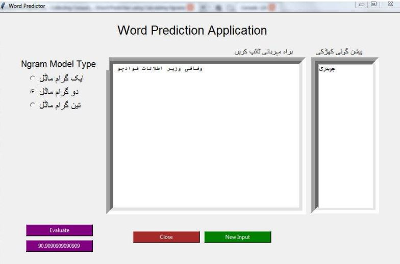

# Next Word Prediction for Urdu
  
### Data Collection and cleaning:
I collected the 42k tokens from https://jang.com.pk latest news, amazing, and entertainment section. For the rest of the corpus, I collected small files having few sentences and then used python to collect text from those files cleaned them, and converted them into proper sentences by using regular
expressions. I was able to collect more than 1.6M of corpus within seconds. I read the sentences one by one and added the start and end marker after cleaning it and exported a new file named startEndAdded.

### Model and Prediction.
For calculating Unigram, Bigram and Trigram I used startEndAdded. For unigram, I counted the count of each word in startEndAdded and then divided it by the total
no of words in startEndAdded which gave me the probability of Unigrams which I exported into a UnigramProb file for later use. For Bigram first I made the bigrams from the startEndAdded file then I counted their count next from each bigram I checked its previous word and using UnigramCont got their count as well and then divided the bigram count with the unigram count which gave me the Bigram Probability which I exported into BigramProb file for later use.
Lastly, for trigram, I made the trigrams using the startEndAdded file and counted their count then from each trigram I checked its previous two words, and using Bigram Count I got their count and then divided the trigram count with the Bigram Count which gave me the Trigram probability which I exported into a file named TrigramProb.
Finally, I build an interface with Tkinter and used these probabilities to build a system for next word prediction by these 3 Ngram models for predicting the next top 10 words.
